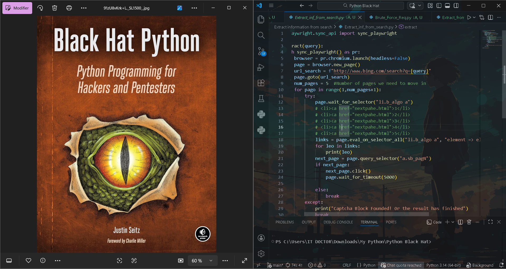

# 🛠️ Python Black Hat Toolkit

  

### Overview
This repository is a collection of specialized Python tools designed for **Offensive Security**, **OSINT** (Open Source Intelligence), and **Automated Information Gathering**. Each module is organized into its own directory, focusing on a specific phase of a security audit.

---

### 📂 Project Structure

| Module (Folder Name) | Description | Technical Focus |
| :--- | :--- | :--- |
| **Brute Force Req** | Discovers hidden server paths using wordlists. | `requests`, Path Fuzzing |
| **Extract Domain Info** | Retrieves WHOIS and IP intelligence data. | `whois` API |
| **Extract from Site** | Scrapes emails, links, and media using a headless browser. | `playwright`, Regex |
| **Extract Hidden Paths** | Automated directory discovery and fuzzer tool. | File I/O, `requests` |
| **Extract Inf from Search** | Bing-based OSINT scraper with multi-page support. | Pagination, Playwright |
| **Extract Input Fields** | Analyzes HTML forms to identify potential attack vectors. | DOM Parsing |
| **Extract Subdomains** | High-speed, multi-threaded subdomain brute-forcer. | Recursion, ThreadPoolExecutor |
| **OSINT** | Aggregates search results into structured data lists. | Data Structuring |

---

### 📺 Live Demo
Watch the **Extract Subdomains** tool in action, demonstrating high-speed concurrent scanning:

  <video src="media/video.mp4" width="100%" controls title="Subdomain Brute-force Demo"></video>

---

### 🚀 Technical Highlights

* **Browser Automation**: Extensive use of **Playwright** to bypass JavaScript-heavy protections and render dynamic content.
* **Concurrency**: Implementation of **Multithreading** via `ThreadPoolExecutor` to optimize network-bound tasks.
* **Data Accuracy**: Use of **Regular Expressions (Regex)** for precise extraction of sensitive data like emails and phone numbers.
* **Evidence Collection**: Built-in capabilities to record browser sessions as video files for professional security PoCs.

---

